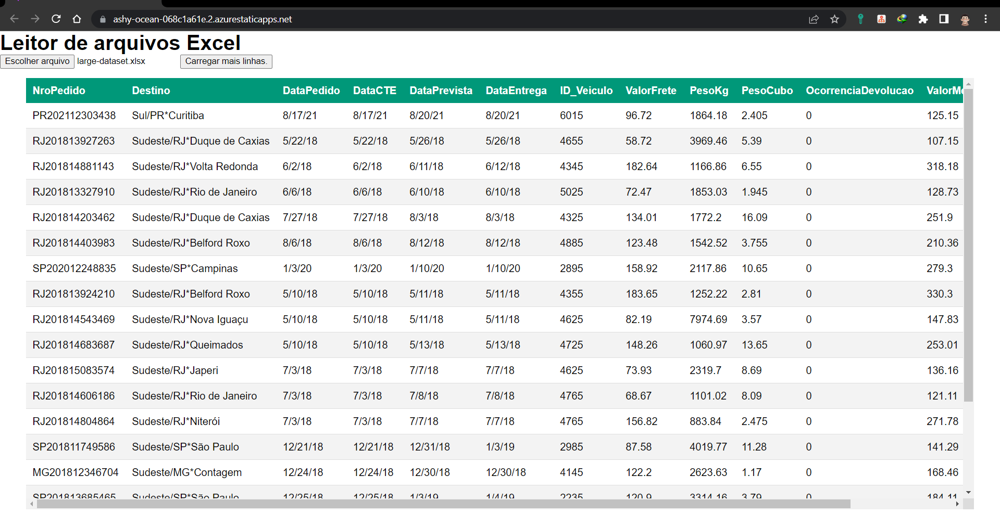

# onDemand-PlanReader

<details>
<summary>👈🏽 <strong>Prévia</strong></summary>
  <br />
  <div align="center">
    
  </div>
</details>

## Aviso importante ⚠️

Certifique-se de que o seu navegador tenha a ultima versão instalada, pois alguns recursos usados nesse projeto são relativamente novos e podem não funcionar em navegadores mais antigos. _(futuramente será adicionado testes para verificar se o navegador tem suporte aos recursos utilizados)_.

## O que é o projeto?

Esse projeto visa explorar os recursos de alto nível dos navegadores modernos, o objetivo final, é criar uma aplicação que seja capaz de ler planilhas massivas de diferentes tamanhos, porém procesando do lado do cliente, sem que a experiência do usuário seja prejudicada. Acesse [aqui](https://ashy-ocean-068c1a61e.2.azurestaticapps.net/).

## Tecnologias

- [Vite.Js](https://vitejs.dev/): O Vite é um empacotador de módulos para aplicações web modernas. Ele tem como dependência o [esbuild](https://esbuild.github.io/), e é projetado para fornecer uma experiência de desenvolvimento super rápida e uma experiência de construção otimizada para produção.
- [React](https://react.dev/): Uma biblioteca JavaScript para criar interfaces de usuário (é mais que isso).
- [TypeScript](https://www.typescriptlang.org/): TypeScript é um superconjunto de JavaScript desenvolvido pela Microsoft que adiciona tipagem e alguns outros recursos a linguagem.
- [SheetJS](https://docs.sheetjs.com/): Uma biblioteca JavaScript para ler e escrever planilhas na Web ou outra plataforma baseada em Javascript. SheetJs transforma planilhas em outros formatos até mesmo HTML, bem como transforma outros formatos de dados em planilhas `xlsx`, `xls`... por baixo dos panos, na parte da Web o SheetJs usa o [File System Acess Web API](https://developer.mozilla.org/en-US/docs/Web/API/File_System_Access_API) e do lado servidor o SheetJs usa lib de manipulação de sistemas de arquivos com o [FileSystem (fs)](https://nodejs.org/docs/latest-v18.x/api/fs.html) do [Node.Js](https://nodejs.org/).
- [React-toastify](https://fkhadra.github.io/react-toastify/introduction): Uma biblioteca React com componentes de notificações, bem simples de usar.
- [WebWorkers](https://developer.mozilla.org/en-US/docs/Web/API/Web_Workers_API/Using_web_workers): Uma API que permite executar scripts em segundo plano, sem bloquear a interface do usuário. O script é executado em um Worker, que roda em um thread diferente do thread principal. O thread principal pode enviar mensagens para o Worker assincronamente e o Worker pode enviar mensagens de volta para o thread principal.

## Instalação

Baixe o repositório e instale as dependências:

```bash
git clone https://github.com/src-rodrigues/onDemand-PlanReader.git
cd onDemand-PlanReader
npm install
```

## Execução

Para o ambiente de desenvolvimento, execute:

```bash
npm run dev
```

Para a visualização de pré-produção, execute:

```bash
npm run build
npm run preview
```

Isso irá gerar uma pasta `dist` com os arquivos estáticos, `preview` então cria um servidor local que serve esses arquivos estáticos da pasta dist. Esse arquivos serão os mesmos para a produção.

## Deploy

Para o deploy, sugiro o Azure Static Web Apps, mas pode ser qualquer outro serviço de hospedagem de sites estáticos.

## Futuro

- [ ] Adicionar testes
- [ ] Resolver alguns problemas de performance em planilhas grandes (50MB ou 300mil linhas)+, algumas faltas de sincronia entre o processamento e a renderização. Adicionar suporte a `stream` de dados em algumas etapas do processamento, separar etapas pesadas para menos bloqueios de UI.
- [ ] Melhorar a organização do código, aplicando boas práticas de programação e padrões de projeto
- [ ] Adicionar suporte a outros formatos de planilhas (xlsx, csv, etc)
- [ ] Adicionar suporte a planilhas com mais de uma aba
- [ ] Adicionar backend para escalar e para atender computadores com recursos mais limitados

## Mais algumas considerações sobre desempenho e sobre o projeto

A biblioteca SheetJs implementa dois métodos de conversão de um objeto que eles apelidaram de `WorkSheet` para um objeto JSON, um método comum de procesamento `sequêncial` e um método de processamento em `stream`.

A única diferença do `to_json` usando `stream` para o `to_json` usando o método normal sequêncial, é que no método normal todo o worksheet (passando `Range` ou não) é processado bloqueando a thred princípal. Já no `to_json` executado pelo objeto `stream` cada linha é processada unicamente e a resposta já é devolvida. Ambos os casos são úteis em diferentes contextos.

Com stream, o arquivo pode ser obtido do navegador do usuário passando a refêrencia do arquivo para o `worker` em segundo plano, faz-se então o processamento para ArrayBuffer também realizado no worker. Do `WorkBook` para o `WorkSheet` não há grande processamento visto que o WorkSheet já existe no objeto WorkBook.

### Maiores tarefas bloqueantes.

As maiores tarefas bloqueantes são três:

A primeira depende do contexto, é a obtenção do arquivo no caso da REDE, na rede não há uma tarefa bloqueante por processamento, mas sim por espera da resposta do servidor que fornece o arquivo, por tanto há bloqueio, mas por espera.

A segunda tarefa bloqueante, é a tarefa de processamento do objeto `response` para Array de Bytes `(ArrayBuffer)`, em ambos os cenários (dados providos da rede, e dados providos do usuário) o arquivo será transformado para um Array de Bytes.

No caso do arquivo provido pela máquina do usuário, o objeto `File` será usado. File guarda informações sobre o arquivo (não o arquivo bruto na memória, mas sim sua refêrencia de localização na RAM e demais informações).

No caso de arquivo provido pela rede, o arquivo contido na `Promise` (esse em memória necessariamente "mas não sei ao certo, se o chrome salva o estado desse arquivo no disco"...), esse arquivo será usado para a transformação em ArrayDeBytes.

A terceira tarefa, é de responsabilidade da API SheetsJs, que é processar o Array de Bytes (ArrayBuffer), para o objeto pertencete à API SheetsJs, o WorkBook. Essa tarefa também é pesada e bloqueante. E é nessa tarefa que esse arquivo `WorkSheet` será mantido em memória pois a partir do momento que ele é processado os dados podem ser obtidios sob demanda, visto que esse objeto guarda um array com vários arrays representando as linhas das planilhas (Uma matriz), por isso, é mais facilmente manipulável.

### Possíveis melhorias de desempenho

Toda melhoria, se baseia em equilibrar: processamento, espaço ocupado na memória pelos objetos, I/O, concorrência entre os processos. Ou seja, é possível delagar parte do processamento para a máquina do usuário, porém isso é delicado. Corre-se o risco de a aplicação tomar maior fatia de tempo de processamento e concorrer com os processos do usuário fazendo que haja bloqueios de UI.

Então algumas "boas práticas" podem ser adotadas

- Certificar-se que não se mantenha na memória recursos que represente o mesmo objeto só que em formatos/estruturas diferentes, como por exemplo. Não faz sentido guardar o estado do ArrayBuffer de um arquivo excel junto com a sua versão em Objeto WorkBook.

- No caso de arquivos obtidos em rede, certificar-se de que arquivos grandes possam ser obtidos sob-demanda usando streams, caso o servidor dê suporte. Isso pode possibilita por exemplo uma recuperação de interrupção de download.

- [x] Uma possível implementação, é que após os dados do WorkSheet serem despachados para o processo princípal e renderizado no front-end, é possível alterar o estado do array de linhas do objeto WorkSheet, removendo aqueles que já foram lidos e desocupando memória `(Já implementado)`.

- O método stream, que retorna de linha em linha seria interessante para computadores fracos, visto que quando um processamento é pausado, a responsibidade da máquina do usuário melhor , pois há uma divisão no tempo de execução das tarefas (tarefas menores dão espaço há outras tarefas, o que melhora a responsividade geral do sistema). A abordagem seria, (vou dividir esse processo grande, em pequenas partes, de forma que demore mais tempo para ser processado, porém diminue o bloqueio).

- Não permitir manter muitos objetos vivos em memória limitar o usuário em questão de manter objetos vivos em memória ou enviar arquivos muito grandes e mau otimizados, existe diversas técnicas, compressão é uma delas.


<div align='left'>

### autor e contato:

 | [](https://github.com/src-rodrigues) |
 | :------------------------------------------------------------------------------------: |
 |                  [_Victor Rodrigues_](https://github.com/src-rodrigues)                  |

</div>

- [_LinkedIn_](https://www.linkedin.com/in/victor-taveira/)
- [_GitHub_](https://github.com/src-rodrigues)
- [_Twitter_](https://twitter.com/otaveirinha)

Um projeto de código aberto, feito com ❤️ por Victor Rodrigues, com contribuição e apoio dos envolvidos do programa [Desenvolve](https://desenvolve.grupoboticario.com.br/).

### Contribua

Viu algum erro de conceito ou de implementação? Tem alguma sugestão de melhoria? Entre em contato comigo! Se você gostou do projeto, ou quer contribuir, fique a vontade para abrir uma [issue](https://github.com/src-rodrigues/onDemand-PlanReader/issues) ou um [pull request](https://github.com/src-rodrigues/onDemand-PlanReader/pulls).
